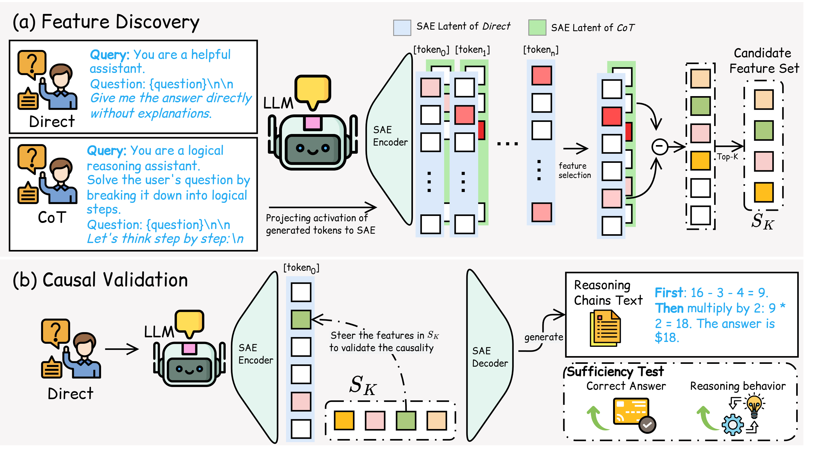

# Triggering Chain-of-Thought via Latent Feature Interventions in Large Language Models

## Overview

This repository contains the code for identifying and steering reasoning-related latent features in large language models. We use Sparse Autoencoders (SAEs) to compare activations under direct and Chain-of-Thought (CoT) prompting, identify candidate features, and test their causal role through targeted interventions.

Experiments cover six models from the LLaMA, Qwen, and Gemma families on GSM8K, GPQA, and BBH. The results show that steering a small number of latent features can induce reasoning under direct prompting, while suppressing them can impair reasoning under CoT prompting.


<p align="center">
  
</p>


## Key Contributions

- A two-stage framework for discovering reasoning-related SAE features and validating them through intervention.
- Evaluation across six models, three model families, and three reasoning benchmarks.
- Evidence that reasoning-related features act early in generation and generalize across prompts and datasets.
- Comparison with dense activation steering and suppression experiments under CoT prompting.

## Features

- Direct, CoT, and alternative reasoning prompt strategies.
- Hidden-state and SAE latent activation extraction.
- Sparse feature discovery from activation differences.
- Sparse and dense activation steering, including suppression experiments.
- Dataset loaders for GSM8K, GPQA, and BBH.
- Evaluation and visualization utilities.

## Setup

```bash
pip install -r requirements.txt
```

Download the required datasets and update the following fields in a file under `config/`:

- `dataset.paths`
- `model.name`
- `sae.model_name`

Model access and a CUDA-capable GPU are required for the main experiments.

## Usage

Run a baseline experiment:

```bash
python src/run_experiment.py \
  --run_baseline \
  --config config/Llama8B.yaml \
  --device cuda:0 \
  --token_pos 1
```

Pipeline script templates are provided for feature extraction, analysis, and steering:

```bash
bash scripts/extract_z.sh
bash scripts/run_analysis.sh
bash scripts/steering.sh
```

Align their config, layer, device, feature index, and steering strength before running them as a pipeline. Outputs are written to `results/`.

## Structure

```text
├── config/            Model, dataset, SAE, and prompt configurations
├── scripts/           Baseline, feature extraction, analysis, and steering scripts
├── src/
│   ├── analysis/      SAE implementations and latent feature analysis
│   ├── my_datasets/   Dataset loaders
│   ├── strategies/    Direct, CoT, and hint strategies
│   ├── utils/         Configuration and evaluation utilities
│   └── run_experiment.py
├── data/              Local datasets (not tracked)
└── results/           Experiment outputs (not tracked)
```

## Paper

Please refer to the accompanying paper for the full method, experimental settings, and results.
